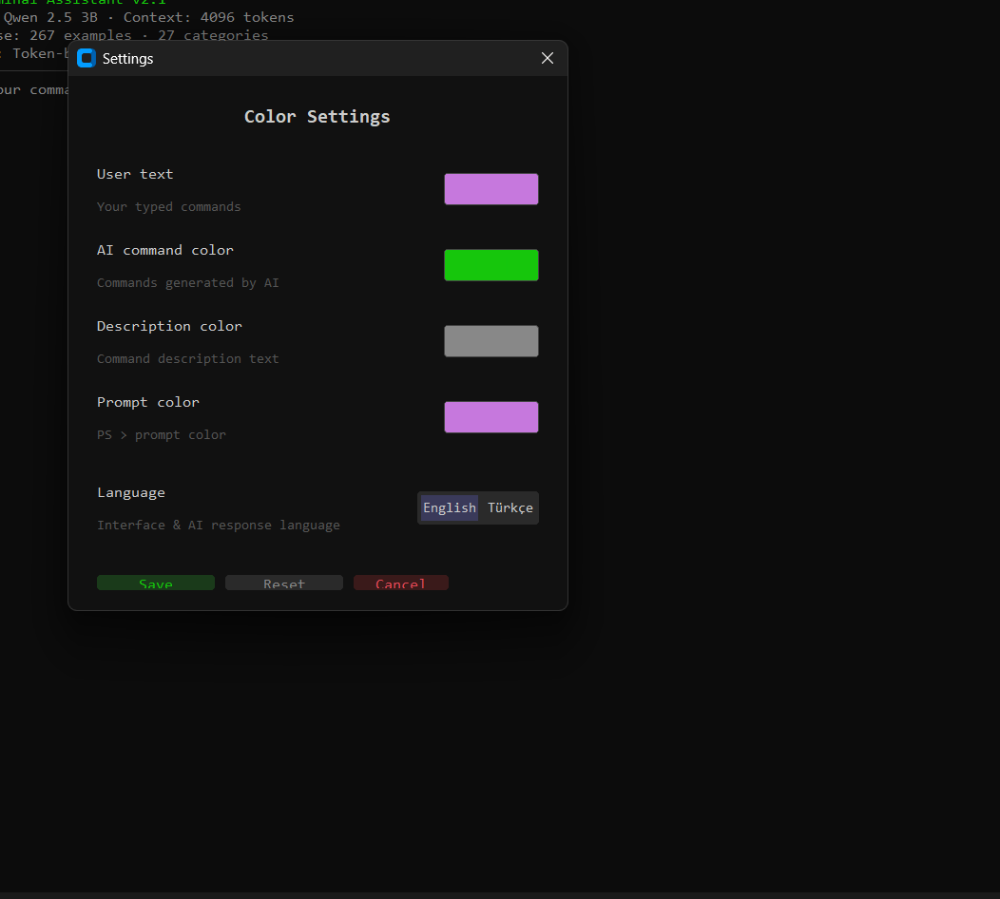

<div align="center">

# ⚡ LingoCLI: AI Terminal Assistant

**A local AI-powered terminal assistant for Windows PowerShell, powered by its OWN Custom Finetuned Model.**  
Runs entirely on your machine — no internet, no API keys, no cloud. Just you and your local, specially trained AI.


[](https://python.org)
[](https://lmstudio.ai)
[](https://huggingface.co/Carus10/LingoCLI-Qwen2.5-3B)
[](LICENSE)
[](https://www.microsoft.com/windows)

</div>

---

## 🎯 What Is This?

LingoCLI is a desktop application that lets you **control your computer using natural language**. Instead of memorizing commands, just describe what you want in plain English or Turkish — the AI translates your request into a PowerShell command, shows it to you for approval, and executes it.

**Example:**
```
You type:  "create a folder called Projects on desktop"
AI runs:   New-Item -ItemType Directory -Path "$env:USERPROFILE\Desktop\Projects"
```

Everything runs **locally** on your computer using [LM Studio](https://lmstudio.ai) and our **Exclusively Finetuned Qwen 2.5 3B** model (`Carus10/LingoCLI-Qwen2.5-3B`). No data leaves your machine.

---

## 🧠 The Custom Finetuned Model

Unlike other wrappers that use massive, complicated prompts to force a base model to output code, **LingoCLI runs on its own Finetuned Model**. 

We took Qwen 2.5 3B and trained it on a custom **4700+ line bilingual (English/Turkish) DevOps dataset**. As a result:
* The model natively understands terminal execution intents.
* It always outputs in an exact `AÇIKLAMA:/KOMUT:` format without heavy prompting.
* It achieves lower latency and zero "hallucination" on syntax formatting.

---

## ✨ Features

| Feature | Description |
|---|---|
| 🖥️ **Real Terminal Look** | Black background, monospaced font, authentic terminal experience |
| 🤖 **Custom AI Model** | Powered by `LingoCLI-Qwen2.5-3B`, natively trained for Windows PowerShell tasks |
| 🧠 **Smart Memory** | 3-layer token-based memory with auto-summarization — unlimited conversation |
| 📁 **Multi-Project Workspaces** | Up to 3 project slots with isolated memory & per-project working directory (CWD) |
| 🔒 **Security System** | Dangerous commands (delete system files, format disk, etc.) require double confirmation |
| 🌍 **Bilingual** | Full English & Turkish support — switchable instantly from settings |
| 🎨 **Customizable Colors** | Change user text, AI command, description, and prompt colors |
| 🔄 **Git Workflows** | Understands multi-step Git operations natively |
| 🚀 **Auto-Launch** | Automatically starts LM Studio if it's not running |
| 📦 **Standalone .exe** | Can be packaged as a single executable — no Python required |

---

## 📁 Multi-Project Workspaces

LingoCLI supports up to **3 project workspaces** — each with its own isolated memory and working directory. This is perfect for developers who work on multiple projects simultaneously (e.g., a React frontend, a Python backend, and a C# desktop app).

### How It Works

1. Click the **📁 Projects** button in the title bar.
2. A 3-slot panel opens. Click **[+] New Workspace** on an empty slot and pick a folder.
3. Once activated, all commands run **inside that project's directory** (CWD is locked to the project folder).
4. The prompt changes from `PS >` to `YourProjectName >` so you always know which workspace is active.

### Workspace Memory Isolation

Each workspace maintains **its own independent conversation history and memory summary**. Memory is never shared between projects. Here's exactly what happens under the hood:

#### Freeze (Saving) — Triggered when you switch projects or close the app

```
Active Workspace: "E-Commerce Project"
  ├── gecmis[]           →  saved to workspaces.json slot[0].gecmis
  ├── gecmis_ozet        →  saved to workspaces.json slot[0].gecmis_ozet
  ├── toplam_mesaj       →  saved to workspaces.json slot[0].toplam_mesaj
  └── ozetleme_sayisi    →  saved to workspaces.json slot[0].ozetleme_sayisi
```

#### Thaw (Loading) — Triggered when you select a workspace

```
Switching to: "React Frontend"
  ├── workspaces.json slot[1].gecmis       →  loaded into gecmis[]
  ├── workspaces.json slot[1].gecmis_ozet  →  loaded into gecmis_ozet
  └── AI receives: "You are in React Frontend (Dir: C:\Projects\ReactApp).
                     Previous summary: Installed dependencies, created
                     components for login page, configured Tailwind CSS..."
```

#### Real-World Example

```
Monday:    You work on "E-Commerce" — install packages, create models, run migrations.
           Memory: 15 commands, 2 auto-summaries performed.

Tuesday:   You switch to "React Frontend" — build components, configure routing.
           E-Commerce memory is FROZEN to disk (workspaces.json).

Friday:    You switch back to "E-Commerce".
           Memory is THAWED. The AI receives a ~80 token summary:
           "Installed Django packages, created Product and Order models,
            ran migrations, set up admin panel."
           → The AI knows exactly where you left off. Context cost: ~80 tokens
             instead of ~2000+ tokens if raw history were replayed.
```

> **Key Design Decision:** Memory is loaded as a **copy** (not a reference), so runtime changes never corrupt the saved JSON data until an explicit save is triggered.

### Workspace Management

- **Select:** Switch to an existing workspace and resume where you left off.
- **Clear (🗑️):** Remove a workspace slot entirely (deletes its frozen memory).
- **Auto-save on exit:** When you close LingoCLI, the active workspace's memory is automatically saved — no data loss even if you forget to switch.

---

## 🧠 Layered Memory & Auto-Summarization

LingoCLI uses a **3-layer memory architecture** designed to provide unlimited conversation length within a small 4096-token context window:

### Memory Architecture

```
┌──────────────────────────────────────────────────┐
│  Layer 1: System Prompt            (~150 tokens) │  Fixed persona + command DB
├──────────────────────────────────────────────────┤
│  Layer 2: Frozen Summary        (~50-150 tokens) │  Compressed old conversation
├──────────────────────────────────────────────────┤
│  Layer 3: Raw Recent Messages   (variable)       │  Last 3 message pairs (always fresh)
├──────────────────────────────────────────────────┤
│  Layer 4: Response Budget          (1024 tokens) │  Reserved for AI response
└──────────────────────────────────────────────────┘
  Total Context: 4096 tokens (Qwen 2.5 3B)
```

### Token Budget Breakdown

| Component | Tokens | Purpose |
|---|---|---|
| System prompt | ~150 | Persona, rules, command patterns |
| History budget | ~2622 | Raw messages + summary |
| Response budget | ~1024 | AI's answer |
| Safety margin | ~300 | Prevents overflow |

### Auto-Summarization Flow

1. You send a command → AI responds → Both are appended to `gecmis[]` (history).
2. After each response, `gecmis_token_sayisi()` calculates total token usage.
3. When usage exceeds **70% of the history budget** (~1835 tokens):
   - The **last 3 message pairs** (6 messages) are preserved raw.
   - All older messages are sent to the model with a summarization prompt.
   - The model returns a 3–4 sentence summary (~50–100 tokens).
   - This summary replaces the old messages as `gecmis_ozet`.
4. On the next request, the AI receives:
   ```
   [System Prompt] + [CWD Info] + [Summary] + [Last 3 Raw Pairs] + [New Question]
   ```
5. This cycle repeats indefinitely — old context is never completely lost, just compressed.

### Why This Matters

- **10 days of work → ~100 tokens.** Instead of replaying 3000+ tokens of raw history, a frozen summary restores context in just 50–100 tokens.
- **No context overflow.** The summarization trigger prevents the model from ever exceeding its context window.
- **Per-workspace isolation.** Each project's memory is frozen/thawed independently, so switching projects never corrupts context.

---

## 📸 Screenshots

<div align="center">

| Boot Screen | Settings |
|---|---|
| .png) |  |

</div>

---

## 🚀 Quick Start (Step by Step)

### Step 1: Install LM Studio

1. Go to **[https://lmstudio.ai](https://lmstudio.ai)**
2. Download and install **LM Studio** for Windows
3. Open LM Studio

### Step 2: Download the LingoCLI AI Model

1. In LM Studio, click the **Search** bar (magnifying glass) at the left menu.
2. Search exactly for: **`Carus10/LingoCLI-Qwen2.5-3B`**
3. Download the **GGUF** version (usually 1.93 GB).
4. Wait for the download to complete.

> **💡 Note:** This is our custom finetuned version of Qwen. It is optimized to run lightning-fast on 4-bit quantization, even without a GPU!

### Step 3: Start the LM Studio Server

1. In LM Studio, go to the **"Local Server"** tab (left sidebar, `<->` icon)
2. Select the **LingoCLI-Qwen2.5-3B** model from the dropdown at the top.
3. Click **"Start Server"**
4. You should see: `Server running on http://localhost:1234`

### Step 4: Clone This Repository

```bash
git clone https://github.com/YOUR_USERNAME/LingoCLI.git
cd LingoCLI
```

### Step 5: Install Python Dependencies

Make sure you have **Python 3.10+** installed. Then:

```bash
pip install customtkinter requests
```

### Step 6: Run the App

```bash
python main.py
```
*(or `python ai_terminal_asistan.py` depending on your entry point)*

That's it! The app will test the server connection and open the terminal interface, ready to serve as your local system expert.

---

## 📦 Build Standalone .exe (Optional)

Want to run the app **without Python installed**? Build it as a standalone executable:

### 1. Install PyInstaller

```bash
pip install pyinstaller
```

### 2. Build the .exe

```bash
python -m PyInstaller --noconfirm --onefile --windowed --name "AI_Terminal" --add-data "komut_veritabani.py;." --add-data "dil.py;." --hidden-import customtkinter --collect-all customtkinter ai_terminal_asistan.py
```

### 3. Find Your .exe

The executable will be in the `dist/` folder. Double click `AI_Terminal.exe` to run.

---

## 🎮 How to Use

### Basic Usage

Just type what you want in natural language:

| You Type | AI Executes |
|---|---|
| `create a folder called Test on desktop` | `New-Item -ItemType Directory -Path "$env:USERPROFILE\Desktop\Test"` |
| `list all files in Documents` | `Get-ChildItem -Path "$env:USERPROFILE\Documents"` |
| `Masaüstümdeki Test klasörünü sil` | `Remove-Item -Path "$env:USERPROFILE\Desktop\Test"` |
| `projem için python gitignore oluştur` | `Set-Content -Path ".gitignore" -Value "__pycache__/...` |

### Dangerous Commands

If the AI generates a potentially dangerous command (delete system files, format disk, shutdown, etc.), local Python guardrails intercept the request and prompt an **extra confirmation dialog** before it runs:

```
⚠ DANGER: Bulk force delete
[Are you sure? Yes / No]
```

### Session Management

- **+ New Session:** Clears all memory and starts fresh
- **📁 Projects:** Open the workspace selector to switch between up to 3 project folders
- **ⓘ Info:** Shows memory usage, token budget, workspace status, and system stats
- **Memory Bar:** Shows real-time memory usage in the title bar

---

## 🏗️ Project Structure

```
LingoCLI/
├── ai_terminal_asistan.py    # Main app: UI, boot screen, memory, workspaces, API
├── komut_veritabani.py       # Danger guardrails & minimal persona logic
├── dil.py                    # Translation module (EN/TR, 100+ keys)
├── terminal_ayarlar.json     # User settings (colors, language)
├── workspaces.json           # Workspace slots: paths, frozen memory, summaries
├── assest/
│   └── screenshots/          # App screenshots
├── dist/
│   └── AI_Terminal.exe       # Standalone executable (after build)
└── README.md                 # This file
```

---

## 🔧 Troubleshooting

| Problem | Solution |
|---|---|
| **"Connection error"** | Make sure LM Studio is running and the server is started on port 1234 |
| **App doesn't start** | Check Python 3.10+ is installed: `python --version` |
| **Turkish characters broken** | The app uses UTF-8. Make sure your terminal supports it |
| **Workspace folder missing** | If a project folder was moved or deleted, LingoCLI will show an error. Clear the slot and re-add. |

> Built with ❤️ using Python, CustomTkinter, and local Custom AI. No cloud. No API keys. No data leaves your machine.
