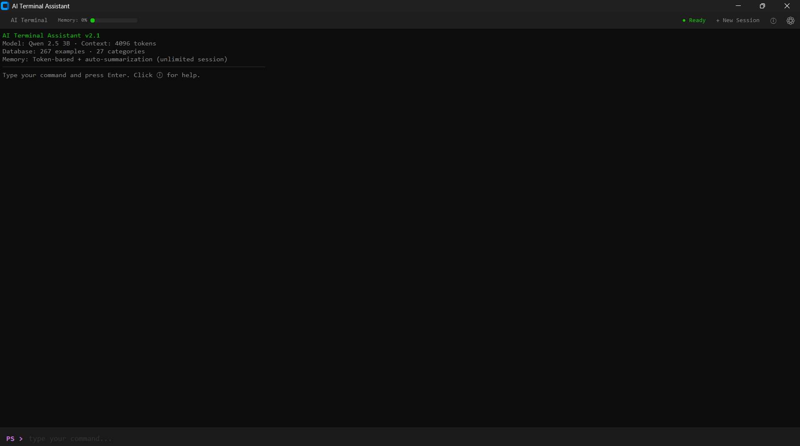

<div align="center">

# ⚡ LingoCLI: Universal AI Terminal Assistant

**A local AI-powered terminal assistant for Windows PowerShell, compatible with ANY local LLM.**  
Runs entirely on your machine — no internet, no API keys, no cloud. Just you and your choice of a local brain.



[](https://python.org)
[](https://lmstudio.ai)
[](LICENSE)
[](https://www.microsoft.com/windows)

</div>

---

## 🎯 What Is This?

LingoCLI is a desktop application that lets you **control your computer using natural language**. Instead of memorizing commands, just describe what you want in plain English or Turkish — the AI translates your request into a PowerShell command, shows it to you for approval, and executes it.

**Example:**
```
You type:  "create a folder called Projects on desktop"
AI runs:   mkdir $env:USERPROFILE\Desktop\Projects
```

Everything runs **locally** on your computer using [LM Studio](https://lmstudio.ai). It works with any model you load (Llama 3, Qwen 2.5, etc.), though models with 9B+ parameters are highly recommended for complex tasks.

---

## 🧠 Universal Zero-Shot Intelligence

The new **LingoCLI v2.5** uses advanced "Zero-Shot Prompt Engineering" to leverage the raw intelligence of modern LLMs without needing custom weights.

### Why Use LingoCLI?
* **Model Agnostic:** Load whatever model you want in LM Studio. LingoCLI automatically detects the loaded model and adapts the UI.
* **Smart JSON Formatting:** Our robust system prompt ensures the AI outputs strict JSON formats for reliable terminal execution.
* **Context Awareness:** The system provided current working directory (CWD) and project-specific memory summaries.
* **Fantom Execution:** Commands are executed in a hidden background environment with zero UI lag.

---

## ✨ Features

| Feature | Description |
|---|---|
| 🖥️ **Real Terminal Look** | Black background, monospaced font, authentic terminal experience |
| 🤖 **Agnostic AI** | Plug and play with any model loaded in LM Studio |
| 🚀 **Fantom Execution** | Background command execution with zero UI freeze |
| 🧠 **Smart Memory** | 3-layer token-based memory with auto-summarization |
| 📁 **Multi-Project Workspaces** | Up to 3 project slots with isolated memory & directories |
| 🔒 **Security System** | Dangerous commands require double confirmation via a regex-based kalkan |
| 🌍 **Bilingual** | Full English & Turkish support |
| 🎨 **Customizable Colors** | Change terminal colors to suit your style |

---

## 🚀 Quick Start (Step by Step)

### Step 1: Set Up LM Studio
1. Install **LM Studio** from [lmstudio.ai](https://lmstudio.ai).
2. Download any capable model (e.g., **Qwen 2.5 7B/14B** or **Llama 3.1 8B**).
3. Start the "Local Server" inside LM Studio on port `1234`.

### Step 2: Launch LingoCLI
1. Run `LingoCLI.exe` from the `dist` folder.
2. The app will automatically detect your loaded model.
3. Start typing commands!

---

## 📁 Multi-Project Workspaces

LingoCLI supports up to **3 project workspaces**. Each workspace maintains:
1. **Isolated Memory:** Conversation history is stored per project.
2. **Locked Directory:** Commands always run inside the project folder.

---

## 🔒 Security

We don't trust the AI blindly. Every command is:
1. **Shown for Approval:** You must click "Çalıştır" (Run) for every command.
2. **Regex Filtered:** Destructive patterns (e.g., `rm -rf C:\Windows`) are flagged for extra confirmation.

---

## 🛠️ Installation (Developers)

```bash
git clone https://github.com/Cihan10/LingoCLI.git
cd LingoCLI
pip install -r requirements.txt
python ai_terminal_asistan.py
```

---

## ⚖️ License

Distributed under the MIT License. See `LICENSE` for more information.
