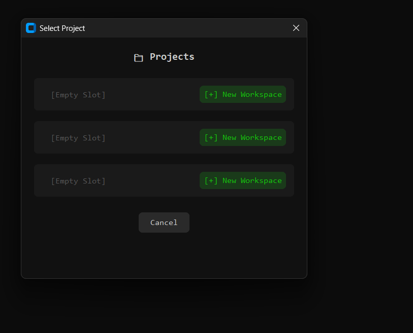

<div align="center">

# ⚡ LingoCLI: Modern AI Terminal Assistant

**A high-performance, bilingual terminal assistant powered by local AI. Compatible with any LLM via LM Studio.**  
*Run complex terminal operations using natural language—completely offline, secure, and private.*

---


[](https://python.org)
[](https://lmstudio.ai)
[](LICENSE)
[](https://www.microsoft.com/windows)

</div>

---

## 🎯 Overview

LingoCLI transforms your terminal experience by integrating a local Large Language Model (LLM) directly into your workflow. Instead of memorizing obscure PowerShell syntax, simply describe your intent in **English or Turkish**. The AI generates the precise command, explains its function, and executes it upon your approval.

**Key use cases:**
*   "Create a backup of this folder and compress it into a zip"
*   "List all files larger than 100MB in this directory"
*   "Initialize a new git repository and push it to my remote"

---

## ✨ Features

### 🌍 100% Bilingual & Reactive
Switch instantly between **English and Turkish**. The entire interface, including AI system prompts, command explanations, and even default templates, updates in real-time.

### 📁 Advanced Workspace Management
Maintain up to **3 project slots**. Each workspace stores its own context, memory summaries, and maintains a persistent working directory.

### 📋 Command Templates
Save frequent workflows as templates. Supports dynamic parameters (e.g., `git commit -m "{message}"`) and comes with pre-configured templates for Git and System tasks.

### ⚡ Script Mode & Automation
Record your terminal session and export it as an automated script. Run scripts step-by-step with **AI-powered error correction**—if a step fails, the AI analyzes the error and suggests a fix on the fly.

### 🛡️ Safety & Guardrails
A regex-based security kalkan (shield) audits every AI-generated command. Destructive operations (system deletes, reboots, etc.) trigger high-visibility danger warnings.

---

## 🖼️ Screenshots

<div align="center">

| **Main Interface** | **Command Templates** |
|:---:|:---:|
|  |  |
| **Project Management** | **Advanced Settings** |
|  |  |

</div>

---

## 🚀 Installation & Setup

### 1. Requirements
*   **OS**: Windows 10/11 (with PowerShell)
*   **Hardware**: 8GB+ RAM recommended (for local LLM)
*   **Software**: [LM Studio](https://lmstudio.ai)

### 2. Prepare the AI (LM Studio)
1.  Download and install **LM Studio**.
2.  Search for and download the **Recommended Model**: `Qwen 3.5 4B` (or Qwen 2.5 3B/7B for peak performance).
3.  Navigate to the **AI Chat / Local Server** tab.
4.  Load the model and **Start Server** on port `1234`.

### 3. Launch LingoCLI
1.  Navigate to the `dist` folder.
2.  Run **`AI_Terminal.exe`**.
3.  The app will automatically detect your model and workspace—you're ready to go!

---

## 🛠️ For Developers

If you wish to run from source or contribute:

```bash
# Clone the repository
git clone https://github.com/carus10/LingoCLI.git

# Install dependencies
pip install -r requirements.txt

# Run the application
python ai_terminal_asistan.py
```

---

## ⚖️ License

Distributed under the MIT License. See `LICENSE` for more information.

---

<div align="center">
  <sub>Built with ❤️ for the terminal enthusiasts by <b>LingoCLI AI Team</b></sub>
</div>
